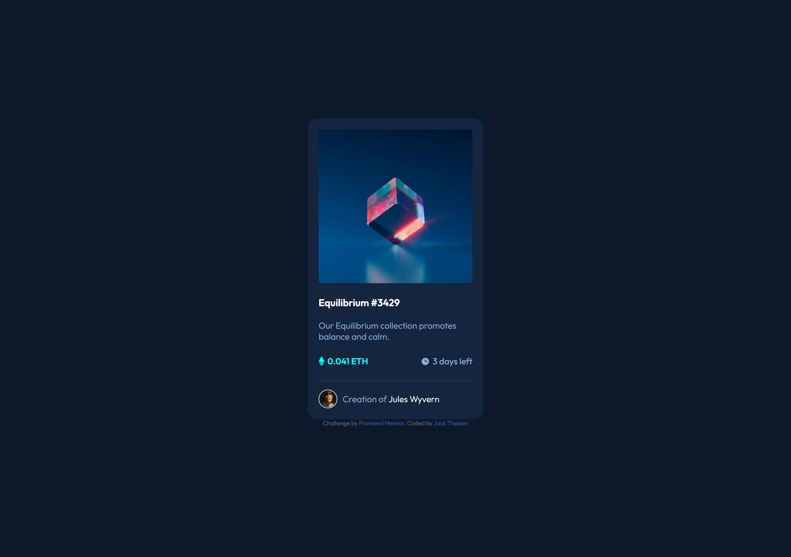

# Frontend Mentor - NFT preview card component solution

This is a solution to the [NFT preview card component challenge on Frontend Mentor](https://www.frontendmentor.io/challenges/nft-preview-card-component-SbdUL_w0U). Frontend Mentor challenges help you improve your coding skills by building realistic projects. 

## Table of contents

- [Overview](#overview)
  - [The challenge](#the-challenge)
  - [Screenshot](#screenshot)
  - [Links](#links)
- [My process](#my-process)
  - [Built with](#built-with)
  - [What I learned](#what-i-learned)
  - [Continued development](#continued-development)
- [Author](#author)

**Note: Delete this note and update the table of contents based on what sections you keep.**

## Overview

### The challenge

Users should be able to:

- View the optimal layout depending on their device's screen size
- See hover states for interactive elements

### Screenshot

### Links

- Solution URL: [Solution](https://www.frontendmentor.io/solutions/responsive-nft-preview-card-ObRcgFMBb)
- Live Site URL: [Live Site](https://kay0ss.github.io/nft-preview-card/)

### Built with

- Semantic HTML5 markup
- CSS custom properties
- Flexbox
- CSS Grid
- Mobile-first workflow

### What I learned

I learned that although some of these styling challenges seem very easy and like they will only take about an hour, sometimes you run into bugs and it takes quite a bit longer, also I learned not to take advantage of how easy I see basic html and css styling to be.

### Continued development

I would like to integrate react into this challenge and fine tune some of my styling aspects in the future.

## Author

- Frontend Mentor - [@Kay0ss](https://www.frontendmentor.io/profile/Kay0ss)
- Github - [@Kay0ss](https://github.com/Kay0ss)

